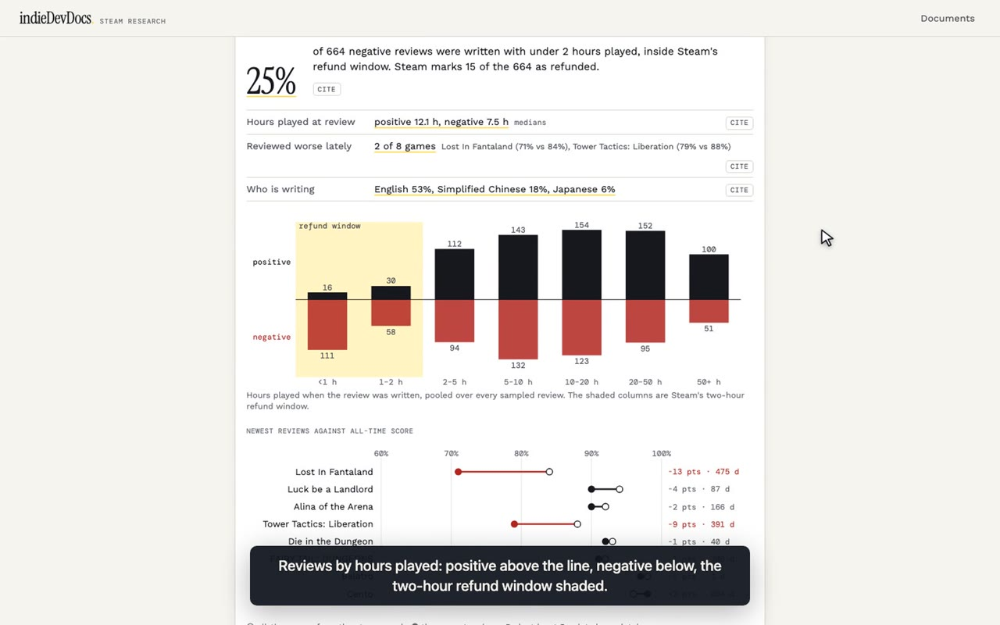
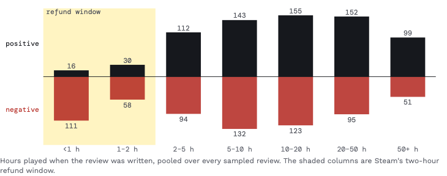

# indieDevDocs

**Research documents for indie game developers, where every number carries its receipt.**

Start a document the day you start thinking about a game. Write down the idea and the
doubts, as you would anyway. The numbers in it come from blocks that go and read Steam. Some read Steam's
public API. Others open each store page in a [Solari](https://getsolari.com) cloud browser
and keep the HTML plus a screenshot with the cited region marked. Every number in the
document opens the receipt it was read from, and the receipt drawer re-hashes the
archived bytes in your browser, so "this is what the run saw" is checked rather than
taken on trust.

```
"298 games on Steam carry Indie + Roguelike Deckbuilder + Pixel Graphics. Of the 8
 closest, [0% (0 of 8)↗] disclose generative AI on their store page."
          └── click: the computation, its 8 inputs, and each input's store page:
              HTML, screenshot, and a replay of the browser that read it
```

[](docs/demo/indieDevDocs-demo.mp4)

https://github.com/user-attachments/assets/ec71ae0f-00ab-43ff-a6ec-595c4ce118b6


## The question it answers

**Is there room for my game in this lane, and what should it cost?** And later, once
you have decided: **can you still show why?**

Pick two or three Steam tags. One run, about two minutes and eight cloud-browser
sessions, gives you numbers like these (Indie + Roguelike Deckbuilder + Pixel Graphics,
read on 1 October 2026):

- **How crowded the lane is.** 298 games carry all three tags. Drop Pixel Graphics and
  it is 1,095; drop Roguelike Deckbuilder and it is 19,982.
- **What the lane charges and how it is received.** A median price of $9.99, 628 reviews
  and 88% positive.
- **The closest games, row by row.** Price, release date, developer, review count and
  Steam's label, for Balatro, Luck be a Landlord, Die in the Dungeon and five others,
  priced from $9.99 to $14.99.
- **Where the lane splits.** The tags most of its games also carry, each searched as a
  narrower lane. Card Battler cuts it to 133 games with a median of 154 reviews;
  Strategy barely narrows it (273).
- **How much of it discloses generative AI.** 0 of the 8 closest.
- **What players reward and punish.** From each comparable's newest 100 reviews and
  newest 100 negative ones: a quarter of the negative reviews (169 of 665) were written
  inside Steam's two-hour refund window; positive reviewers had played a median 12.1
  hours, negative ones 7.5; and 2 of the 8 games are being reviewed worse lately than
  their all-time score.
- **Your decision**, in a sentence, with the numbers it rests on attached. When a later
  run reads one of them differently, the decision says which one moved.

What it does not tell you:

- **Sales, revenue or wishlists.** Review counts are the public signal, and they are
  shown as review counts, not converted into sales estimates.
- **Why players liked or left a game.** `/reviews` counts when and how they reviewed,
  not what they wrote. Reading the text for themes is the next step (see the handoff).
- **The whole lane's medians.** Medians come from the first 25 games of Steam's search,
  in Steam's order, not from every game in the lane. The lane's size is Steam's own count.
- **Who uses AI.** The AI share counts disclosure on the store page, not use.
- Whether your game is any good.

## Why

Indie developers make expensive decisions on thin evidence: whether a niche is
crowded, what comparable games charge, how they are received, and how much of the
lane is filling with AI-generated work. The usual sources are a spreadsheet of
copy-pasted numbers nobody can trace, or third-party sites whose data you can't check.
indieDevDocs keeps the question, the answer and the evidence in one document, and keeps
them attached to each other.

## The model

```
Document → Block → Run → Receipt → Fact
```

- A **block** is a question with parameters ("which games carry all of these tags?").
  In the document it is an atom that holds only its id. Its state lives in Postgres, so
  autosaving prose can never overwrite an answer.
- A **run** is one attempt to answer it. It records the parameters it answered, the
  runtimes it used (API, cloud browser, derived) and what it cost.
- A **receipt** is what a run saw, stored immutably and content-addressed by SHA-256:
  an API response, a page's HTML, a screenshot, or a computation's inputs and formula.
- A **fact** is one typed value read out of one receipt, with a locator (JSON path,
  quoted text, CSS selector, screenshot box, or the facts it was computed from).
  Prose cites facts, never receipts.

Blocks form a DAG. A snapshot and a breadth map read their niche from a comparables block,
and the AI share reads from a snapshot. Change or prune a source and the blocks below it say they are
stale and what re-running would cost. They never re-run on their own. A decision has no
source: it goes stale when the evidence it cites moves.

| Block | Reads | Runtime |
| --- | --- | --- |
| `/comparables` | Steam store search for games carrying every tag you pick. Strike rows that aren't real comparables; the list refills from the same search. | API |
| `/snapshot` | For each comparable: price, release date and developers (appdetails), review counts (appreviews), and the store page itself: tags and Steam's AI-generated-content disclosure. | API + Solari browser |
| `/ai-share` | The share of those store pages that disclose generative AI. Pages that could not be read are left out of the denominator and named, never counted as clean. | Derived |
| `/breadth` | The niche's neighbourhood. One tag narrower: the tags the niche's games most often carry besides yours, each searched as niche + tag, with its size, median price, median reviews and most-reviewed games. One tag broader: the niche minus each of its own tags. Tags nearly every game carries are named as describing the niche, not splitting it. | API |
| `/reviews` | Two pages of each comparable's Steam reviews, newest first: any kind, and negative only. Per game and pooled for the lane: hours played at review, negative reviews inside the two-hour refund window, the recent score against the all-time one, and the languages reviews are written in. Facts hold counts only; no reviewer's words or name. | API |
| `/prototype` | Your web build beside the research. A Solari sandbox clones a public git repository (a branch, a folder holding `index.html`) and serves it; a recorded Solari browser opens it, waits for it to boot, clicks and presses a few keys, and screenshots before and after. Facts: the commit and file count, load time, console errors, failed requests, the canvas size, and whether the screen changed after input. The build stays playable in the document for up to an hour, then the sandbox is stopped. Static builds only: no install or build step runs. | Sandbox + Solari browser |
| `/decision` | Your call, in a sentence, with the numbers it rests on attached from anywhere in the document. Recording it keeps those numbers as they stood. When a later run reads one differently, the decision says which number moved and offers the new reading. It never changes by itself. | Derived |

Blocks draw their answers as charts as well as numbers, each mark opening the receipt it
was read from: comparables as price against reviews; the lane map, with each narrower
lane's size against how many reviews its typical game gets; reviews by hours played,
positive above the line and negative below, with the refund window shaded; each game's
recent score against its all-time one; and each game's share of negative reviews written
in under two hours, beside the lane's.



## Built on Solari

Store pages are read in Solari cloud browsers in `direct` mode, one session per page,
three at a time. Each page yields up to three receipts, kept together: the HTML the
browser rendered, a full-page screenshot with boxes around the regions facts were read
from, and the session's replay (Solari's rrweb recording, downloaded after the browser
is released). Replays are not always available: in runs on 1 October about 3 pages in
8 got one. A page without a replay keeps its HTML and screenshot, and the run says
which replays are missing. Every session starts from the same pinned Solari profile, a cookie jar
holding the store's viewpoint (age gate answered, English), and each receipt names
the profile and version it was read with. The receipt drawer shows the screenshot
scrolled to the box, plays the replay, and lists the browser session id. Without
`SOLARI_API_KEY` the same blocks fall back to plain HTTP, and the receipts say so;
`/prototype` needs a sandbox, so it reports itself blocked.

`/prototype` uses Solari sandboxes as well as browsers. The sandbox clones and serves
the build; `previewUrl(port)` gives the URL the document embeds and the cloud browser
records. That URL carries an access token, so it is kept only in the block's own fact and
scrubbed from every receipt (the HTML, the browser log and the replay). A job queued for
the end of the playable window kills the sandbox; Solari's idle timeout is the backstop.

The kernel (`packages/samsara/kernel`) owns sessions, retries, deadlines and the
per-owner budget. The worker (`apps/worker`) claims `block.run` jobs from a Postgres
queue and, when asked, cascades to the blocks downstream.

## Run it

You need Node 22.9+, pnpm 11, and Docker (for Postgres). A Solari key is optional but is
the point: without one, store pages are read over HTTP and there are no screenshots.

```sh
git clone https://github.com/AswinBehera/solari-IndieDevDocs.git && cd solari-IndieDevDocs
pnpm install
cp .env.example .env          # set SOLARI_API_KEY; DATABASE_URL already points at local Docker
pnpm db:up && pnpm db:migrate
pnpm dev                      # API :8789 (wrangler), web :5174 (Vite), worker loop
```

Open http://localhost:5174, pick two or three Steam tags under **Scout a niche**, create
the document, and press **Run** on the first block with "then the blocks below" ticked.
Eight store pages take about two minutes, up to one of them spent waiting for replays. Click any underlined number for its receipt;
press **Cite** to put a number in your prose.

Auth in development: `apps/api/.dev.vars` sets `DEV_OWNER_ID`, which makes the API accept
any bearer token as that owner. It is committed on purpose and holds nothing secret;
`wrangler deploy` never uploads it.

## Respecting Steam

- Only Steam's own public endpoints and store pages, at a polite concurrency. No
  SteamDB or other third-party scraping, no logged-in sessions, and no evading age
  gates or bot checks. A gated page becomes an `unavailable` fact, not a workaround.
- Receipts stay on the machine that ran the block (`apps/web/public/receipts/`,
  gitignored). They are Steam's content and are not ours to redistribute.
- The data is for your own research. indieDevDocs is not a data product.

## Layout

```
apps/api            Hono on Cloudflare Workers: docs, blocks, runs, facts, receipts, job SSE
apps/worker         job runner; apps/worker/src/research/block-run.ts answers every block kind
apps/web            React + Tiptap editor, block cards, fact chips, receipt drawer
packages/research/core   the model, staleness, cost estimates, fact formatting (pure, tested)
packages/research/db     Postgres store and the migration history
packages/research/steam  Steam URLs and parsers, each returning a locator with its value
packages/samsara/*       the kernel: jobs, sessions, budgets, Solari launcher
```

## History

This repository started as Doen Thang, a travel document built on the same kernel; that
history is kept below the pivot commit, and the travel code was removed after it.
`docs/STATUS.md` is the travel-era log. See [`docs/HANDOFF.md`](docs/HANDOFF.md) for what
is open.
